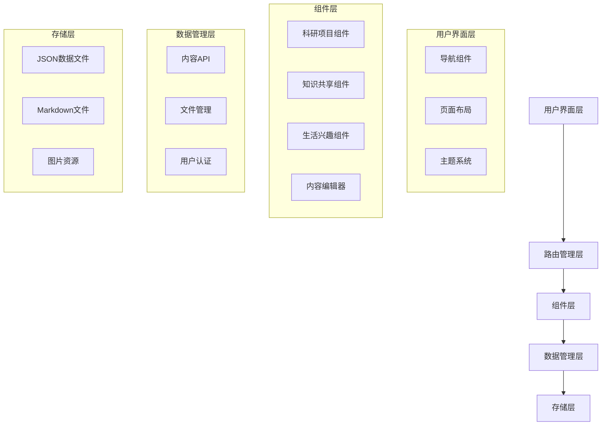

# 设计文档

## 概述

个人网站采用现代化的单页应用(SPA)架构，结合静态站点生成和动态内容管理功能。网站使用HTML5、CSS3、JavaScript构建，采用模块化设计，支持响应式布局和在线内容编辑。

## 架构设计

### 整体架构



### 技术栈选择

- **前端框架**: 原生JavaScript + Web Components
- **CSS框架**: 自定义CSS Grid + Flexbox
- **路由**: History API 实现客户端路由
- **数据存储**: JSON文件 + LocalStorage
- **文件上传**: File API + FormData
- **Markdown渲染**: marked.js库
- **代码高亮**: Prism.js库

## 组件和接口设计

### 核心组件架构

#### 1. 应用主框架 (App)
```javascript
class PersonalWebsite {
    constructor() {
        this.router = new Router();
        this.themeManager = new ThemeManager();
        this.authManager = new AuthManager();
    }
    
    init() {
        // 初始化应用
    }
}
```

#### 2. 路由管理器 (Router)
```javascript
class Router {
    routes = {
        '/': 'home',
        '/research': 'research',
        '/knowledge': 'knowledge', 
        '/interests': 'interests',
        '/admin': 'admin'
    }
    
    navigate(path) {
        // 路由跳转逻辑
    }
}
```

#### 3. 主题管理器 (ThemeManager)
```javascript
class ThemeManager {
    themes = {
        dark: {
            primary: '#1a1a1a',
            secondary: '#2d2d2d',
            accent: '#00ff88',
            text: '#ffffff'
        }
    }
    
    applyTheme(themeName) {
        // 应用主题样式
    }
}
```

### 模块组件设计

#### 科研项目模块
```javascript
class ResearchModule {
    constructor() {
        this.projects = [];
        this.currentProject = null;
    }
    
    renderProjectList() {
        // 渲染项目列表
    }
    
    renderProjectDetail(projectId) {
        // 渲染项目详情
    }
    
    filterProjects(category, tags) {
        // 项目筛选功能
    }
}
```

#### 知识共享模块
```javascript
class KnowledgeModule {
    constructor() {
        this.articles = [];
        this.markdownRenderer = new marked.Renderer();
    }
    
    renderArticleList() {
        // 渲染文章列表
    }
    
    renderArticle(articleId) {
        // 渲染文章内容
    }
    
    searchArticles(query) {
        // 文章搜索功能
    }
}
```

#### 生活兴趣模块
```javascript
class InterestsModule {
    constructor() {
        this.interests = [];
        this.timeline = [];
    }
    
    renderInterestCategories() {
        // 渲染兴趣分类
    }
    
    renderTimeline() {
        // 渲染时间线
    }
    
    renderGallery(category) {
        // 渲染图片画廊
    }
}
```

## 数据模型设计

### 项目数据模型
```json
{
    "id": "project-001",
    "title": "项目标题",
    "description": "项目描述",
    "technologies": ["JavaScript", "Python", "React"],
    "status": "completed",
    "startDate": "2024-01-01",
    "endDate": "2024-06-01",
    "images": ["project1-1.jpg", "project1-2.jpg"],
    "links": {
        "demo": "https://demo.example.com",
        "github": "https://github.com/user/project"
    },
    "category": "web-development",
    "tags": ["frontend", "api"]
}
```

### 文章数据模型
```json
{
    "id": "article-001",
    "title": "文章标题",
    "summary": "文章摘要",
    "content": "markdown内容",
    "publishDate": "2024-01-15",
    "updateDate": "2024-01-20",
    "category": "技术分享",
    "tags": ["JavaScript", "教程"],
    "readTime": 5,
    "featured": false
}
```

### 兴趣数据模型
```json
{
    "id": "interest-001",
    "category": "摄影",
    "title": "风景摄影作品",
    "description": "描述内容",
    "date": "2024-01-10",
    "images": ["photo1.jpg", "photo2.jpg"],
    "location": "地点信息",
    "type": "gallery"
}
```

## 用户界面设计

### 设计系统

#### 颜色方案
```css
:root {
    /* 主色调 */
    --color-primary: #1a1a1a;
    --color-secondary: #2d2d2d;
    --color-tertiary: #404040;
    
    /* 强调色 */
    --color-accent: #00ff88;
    --color-accent-hover: #00cc6a;
    
    /* 文字颜色 */
    --color-text-primary: #ffffff;
    --color-text-secondary: #cccccc;
    --color-text-muted: #888888;
    
    /* 背景色 */
    --color-bg-primary: #0d0d0d;
    --color-bg-secondary: #1a1a1a;
    --color-bg-card: #2d2d2d;
}
```

#### 字体系统
```css
:root {
    --font-family-primary: 'Inter', 'Noto Sans SC', sans-serif;
    --font-family-mono: 'JetBrains Mono', 'Consolas', monospace;
    
    --font-size-xs: 0.75rem;
    --font-size-sm: 0.875rem;
    --font-size-base: 1rem;
    --font-size-lg: 1.125rem;
    --font-size-xl: 1.25rem;
    --font-size-2xl: 1.5rem;
    --font-size-3xl: 2rem;
}
```

#### 布局网格
```css
.container {
    max-width: 1200px;
    margin: 0 auto;
    padding: 0 1rem;
}

.grid {
    display: grid;
    gap: 2rem;
}

.grid-cols-1 { grid-template-columns: 1fr; }
.grid-cols-2 { grid-template-columns: repeat(2, 1fr); }
.grid-cols-3 { grid-template-columns: repeat(3, 1fr); }

@media (max-width: 768px) {
    .grid-cols-2,
    .grid-cols-3 {
        grid-template-columns: 1fr;
    }
}
```

### 页面布局设计

#### 主页布局
- 全屏英雄区域，包含个人介绍和导航
- 三个模块的预览卡片
- 页脚信息

#### 模块页面布局
- 顶部导航栏
- 侧边栏筛选/分类
- 主内容区域
- 分页/加载更多

#### 详情页面布局
- 面包屑导航
- 内容主体区域
- 相关推荐区域

## 错误处理

### 错误类型定义
```javascript
class AppError extends Error {
    constructor(message, code, statusCode = 500) {
        super(message);
        this.code = code;
        this.statusCode = statusCode;
    }
}

const ErrorCodes = {
    NETWORK_ERROR: 'NETWORK_ERROR',
    FILE_NOT_FOUND: 'FILE_NOT_FOUND',
    INVALID_DATA: 'INVALID_DATA',
    AUTH_FAILED: 'AUTH_FAILED'
};
```

### 错误处理策略
1. **网络错误**: 显示重试按钮，提供离线模式
2. **文件加载错误**: 显示占位符，记录错误日志
3. **数据验证错误**: 显示具体错误信息，引导用户修正
4. **认证错误**: 重定向到登录页面

### 用户反馈机制
```javascript
class NotificationManager {
    show(message, type = 'info', duration = 3000) {
        // 显示通知消息
    }
    
    showError(error) {
        // 显示错误信息
    }
    
    showSuccess(message) {
        // 显示成功信息
    }
}
```

## 测试策略

### 单元测试
- 使用Jest框架进行组件和工具函数测试
- 测试覆盖率目标: 80%以上
- 重点测试数据处理、路由、主题切换等核心功能

### 集成测试
- 使用Cypress进行端到端测试
- 测试用户完整操作流程
- 测试不同设备和浏览器的兼容性

### 性能测试
- 使用Lighthouse进行性能评估
- 页面加载时间目标: < 3秒
- 首屏渲染时间目标: < 1.5秒

### 可访问性测试
- 使用axe-core进行可访问性检查
- 支持键盘导航
- 提供适当的ARIA标签
- 确保颜色对比度符合WCAG标准

## 部署和维护

### 构建流程
1. 代码压缩和优化
2. 图片压缩和格式转换
3. CSS和JS文件合并
4. 生成Service Worker用于缓存

### 部署策略
- 支持静态文件托管(GitHub Pages, Netlify等)
- 使用CDN加速资源加载
- 实现渐进式Web应用(PWA)功能

### 内容管理
- 基于文件的内容管理系统
- 支持Git版本控制
- 提供数据备份和恢复功能